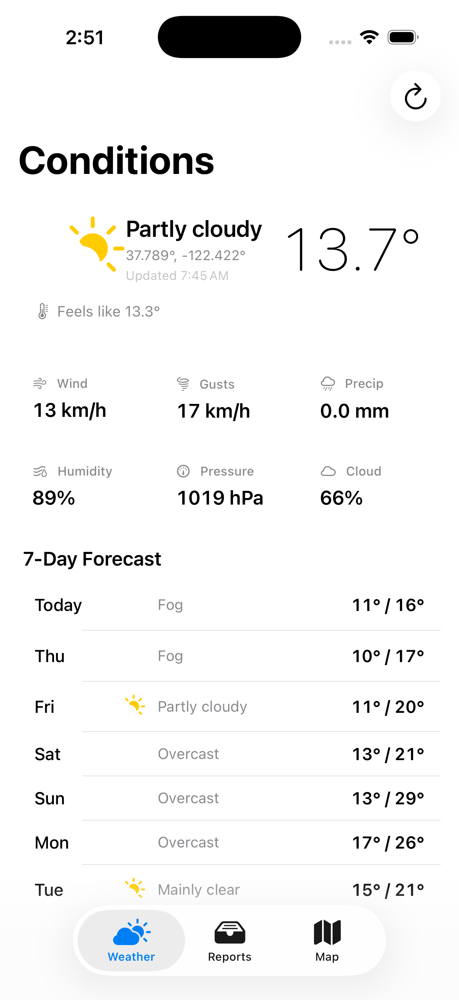
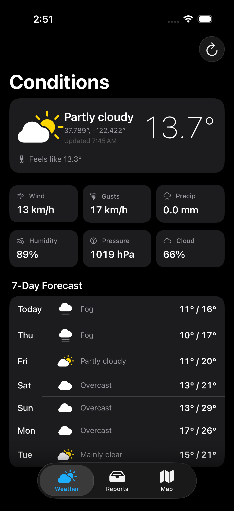

# Storm Chaser

A native iOS app for storm-chasing hobbyist meteorologists, built for the Speer Technologies Mobile Development Assessment.

| Light mode | Dark mode |
|---|---|
|  |  |

## What it does

- **Weather** — gets the current device location, retrieves current weather conditions and a 7-day forecast from Open-Meteo, and extracts the relevant meteorological information needed by storm chasers (wind speed and direction, gusts, rainfall, humidity, air pressure, cloud cover).
- **Reports** — take a picture using either the camera or the photo library, automatically add location coordinates, weather conditions, timestamp, arbitrary notes, and assign one of 9 storm classifications to the picture.
- **Map** — each reported storm will appear as a coloured marker based on its classification. Tapping a marker will reveal the picture in a small thumbnail, tapping the thumbnail will show the detailed report.
- **Offline first** — if there is no network connection, the app will use the last successfully retrieved weather data and display an "offline" banner. All reports will be stored locally and uploaded to the cloud once the network connection is restored.
- **Cloud Sync (optional)** — when the network connection is back, any pending reports will be synced with a Supabase cloud project (using anonymous authentication, Storage, and PostgREST).

## Stack

| Layer | Selection | Reasoning |
|---|---|---|
| UI | SwiftUI (iOS 26.1) | Declarative and modern; built-in `Map`, `.refreshable`, `@Observable` |
| Persistence | SwiftData | Built-in ORM by Apple; single line of in-memory testing container |
| State | `@Observable` ViewModels | Less boilerplate compared to `ObservableObject`, fine-grained rendering |
| Networking | `URLSession` + Codable | No need for any third-party SDKs, resulting in leaner binaries and assessments |
| Location | `CoreLocation` (CLLocationManager) | Encapsulated within protocol for testing purposes |
| Camera/Photos | `UIImagePickerController` (camera) + `PHPickerViewController` (library) | Library feature of UIImagePickerController deprecated in favor of PHPicker |
| Map | `MapKit` SwiftUI APIs (`Map`, `Marker`, `MapCameraPosition`) | Native support on iOS 17+ |
| Cloud | Supabase REST + Storage via plain `URLSession` | No need for Supabase Swift SDK; integration is code only |
| Tests | Swift Testing (`@Test`, `#expect`) | Default test framework for Swift projects on Xcode 26 |

## Architecture

**MVVM with protocol-based dependency injection.**

**Why protocols, not concrete types** — all external dependencies (network, location, photo store) are either protocols or have an injectable seam. ViewModels are tested against in-memory `ModelContainer` + mocked services with no I/O. Look at `WeatherViewModelTests` for how this works in practice.

**Why offline-first** — storm chasers work in places where connection quality is unpredictable. Network calls should be absolutely non-blocking. Data flow:
1. UI -> SwiftData synchronously, instantly reflected in view
2. `SyncCoordinator` monitors `NetworkMonitor` (`NWPathMonitor`) + `nudge()` events
3. When online, drains rows with `syncStatus != .synced`, changing their status to `pending → syncing → synced/failed`
4. If there's no network and row failed to sync previously, it will be automatically resynced upon next network status change

**Why use the Run Script for Supabase config** — Xcode's `INFOPLIST_KEY_*` setting does not pass through custom keys (like `SupabaseURL`) but passes only keys recognized by Apple. Small `plutil -replace` script in Run Script Build Phase adds values from `SUPABASE_URL` and `SUPABASE_ANON_KEY` settings into `Info.plist`. Missing keys -> application runs but with no cloud synchronization and `.disabled` mode of sync coordinator.

## Project structure

```
StormChaser/
├── Models/                    SwiftData @Model + value types (no business logic)
│   ├── StormReport.swift      Persisted report row
│   ├── StormType.swift        Storm classification enum (9 cases)
│   ├── SyncStatus.swift       pending / syncing / synced / failed
│   ├── WeatherData.swift      Codable structs returned by WeatherService
│   └── CachedWeather.swift    Last weather fetch persisted in SwiftData
│
├── ViewModels/                @Observable, @MainActor, no UIKit/SwiftUI imports
│   ├── WeatherViewModel.swift     Orchestrates location + weather + cache
│   └── NewReportViewModel.swift   Photo + metadata + persistence flow
│
├── Services/                  External-facing seams; all conform to a protocol
│   ├── WeatherService.swift              Open-Meteo client
│   ├── LocationService.swift             CLLocationManager wrapper
│   ├── LocationServiceProtocol.swift     Protocol for mocking
│   ├── ImageStore.swift                  File-system photo persistence (injectable baseURL)
│   ├── NetworkMonitor.swift              NWPathMonitor wrapper
│   ├── SupabaseConfig.swift              Reads URL + anon key from Info.plist
│   ├── SupabaseClient.swift              actor — auth, Storage upload, REST insert
│   ├── SyncCoordinator.swift             Drains pending rows when online
│   └── Environment+Services.swift        SwiftUI EnvironmentValues injection
│
├── Views/                     One file per type — no nested private structs
│   ├── ContentView.swift                 Root TabView
│   ├── WeatherView.swift                 Top-level Weather screen
│   ├── ReportsListView.swift             Reports list screen
│   ├── ReportDetailView.swift            Report detail screen
│   ├── NewReportView.swift               New report sheet
│   ├── StormMapView.swift                Map screen
│   ├── Weather/                          Weather subviews
│   ├── Reports/                          Report list subviews
│   ├── ReportDetail/                     Report detail subviews
│   ├── Camera/                           ImagePicker (camera + PHPicker)
│   └── Components/                       Cross-feature reusables (Skeleton, NotFound)
│
└── StormChaserApp.swift       App entry — wires ModelContainer + services into env
```

## Reusable components

- `SkeletonBlock` + `ShimmerModifier` – shimmer effect for any type of loading
- `NotFoundView` – error or empty state with the ability to refresh
- `MetricTile` – key-value tile component displayed on the weather grid
- `MetadataRow` – key-value row component displayed on the report detail
- `SyncBadge` – sync badge pill (syncing / synced / failed)
- `SyncIndicator` – sync cloud indicator displayed on the toolbar
- `OfflineBanner` / `OfflineRow` – offline banner / row displayed when there is no internet connection
- `ImagePicker` – unified view component that toggles between camera (`UIImagePickerController`) and library (`PHPickerViewController`)

## Setup

### Requirements

- macOS with Xcode 26.1+
- iOS 26.1 simulator (or a physical device on the same OS)

### Run

1. Open `StormChaser.xcodeproj` in Xcode
2. Select the **StormChaser** scheme + an iOS 26.1 simulator
3. ⌘R

The app runs **fully offline by default**. No keys, no setup. To enable cloud sync, see [SUPABASE_SETUP.md](SUPABASE_SETUP.md).

### Test

```bash
xcodebuild -project StormChaser.xcodeproj \
  -scheme StormChaser \
  -destination 'platform=iOS Simulator,name=iPhone 17 Pro,OS=26.1' \
  test
```

Or in Xcode: ⌘U.

**14 unit tests** across two ViewModels:

- `WeatherViewModelTests` — refresh success, fail-with-cache, fail-without-cache, location failure, `loadIfNeeded` idempotency, cache row replacement
- `NewReportViewModelTests` — `canSave` guard, save preconditions, full metadata persistence, optional weather attachment, `onSaved` callback, `fetchMetadata` happy path + 2 failure paths

## Feature checklist

| Required | Done | Where |
|---|---|---|
| Weather data view (current location) | ✅ | `WeatherView` + `WeatherViewModel` |
| Key meteorological info (temp, wind, precip…) | ✅ | `LoadedWeatherView` (6-tile grid) |
| "Not found" view | ✅ | `NotFoundView` rendered on `.notFound` state |
| Photo capture | ✅ | `ImagePicker` (camera + library via PHPicker) |
| Photo metadata (conditions, location, timestamp, notes, type) | ✅ | `NewReportViewModel.save()` populates all fields |
| Local persistence | ✅ | SwiftData (`StormReport`, `CachedWeather`) + `ImageStore` |
| Navigation between sections | ✅ | Root `TabView` (Weather / Reports / Map) |

| Bonus (senior bar) | Done | Where |
|---|---|---|
| Weather forecast integration | ✅ | 7-day forecast from Open-Meteo, rendered in `LoadedWeatherView` |
| Map visualization | ✅ | `StormMapView` with type-coloured markers |
| Offline functionality | ✅ | `CachedWeather` + `NetworkMonitor` + sync queue |
| Dark mode support | ✅ | All views use semantic SwiftUI colours; system-driven |
| Skeleton screens | ✅ | `WeatherSkeletonView` with `ShimmerModifier` |
| Pull to refresh | ✅ | `.refreshable` on Weather and Reports |
| Cloud integration | ✅ | `SupabaseClient` (auth + Storage + REST), `SyncCoordinator` |

## Implementation decisions

- **No third-party dependencies.** Compiles with just the iOS SDK. Easier auditing, faster builds, and no SPM resolution gotchas.
- **Supabase anonymous authentication.** No need for a login experience, password storage, yet each report has an associated unique `auth.users` row → RLS behaves as intended. Every device has its own anonymous account.
- **Cloud path UUIDs are lowercase.** PostgreSQL's `auth.uid()::text` outputs lowercase UUID strings, while Swift's `UUID.uuidString` outputs uppercase ones. Storage policies that check for a prefix match between path names and `auth.uid()::text` silently fail when used with uppercase strings. The upload API sends lowercase strings on the wire (`SupabaseClient.uploadPhoto`).
- **Default actor isolation: `MainActor`.** Project-wide Swift setting; all value types (`WeatherSnapshot`, `WeatherReport`, `DailyForecast`) are explicitly `nonisolated` for serialization outside of the main thread.
- **`PBXFileSystemSynchronizedRootGroup`.** New Xcode project format — any Swift file added in `StormChaser/` is detected automatically without pbxproj editing for sources.

## Known trade-offs / next steps

- **JWT in `UserDefaults`.** JWTs in Supabase access and refresh tokens are stored here. In production, that needs to be migrated to the Keychain. Only changes in `SupabaseClient.AuthSession.{load,save}` are necessary.
- **Sync queue only works with in-app requests.** There’s no background tasking with `URLSession` or `BGTaskScheduler`. If the user backgrounds the app while uploading, requests will resume only when the app is in the foreground again. Next up for storm chasers: `BGProcessingTaskRequest`.
- **No conflict resolution.** The `Prefer: resolution=merge-duplicates` header on cloud rows with the `(user_id, client_id)` combination ensures the last upload wins. Editing reports across multiple devices is not something currently considered.
- **Photos can be uploaded in any size.** 4 MB JPEG is uploaded to the server untouched. In a proper product, an image should be reduced in size (~500 KB) first and streamed.
- **ViewModels are tested.** Integration tests for `SyncCoordinator` and `SupabaseClient` against an actual Supabase project run manually. In addition, I’d spend more time adding `URLProtocol` based stubs for these components.
- **No accessibility test.** Dynamic Type and VoiceOver labels are supported automatically from the base component set but haven’t been audited manually.